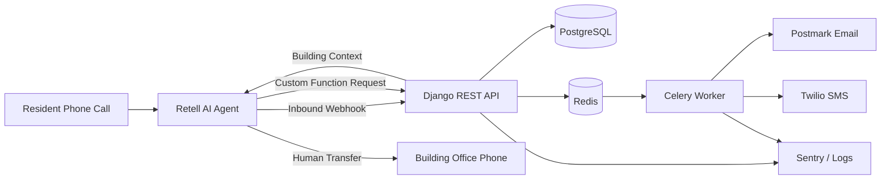

<div align="center">

# 📞🤖 Hello SAM - AI Maintenance Phone Agent

**A production-oriented Django backend for AI-powered apartment maintenance calls.**

Residents call. SAM listens. The backend validates, prioritizes, stores, notifies, and routes.


</div>

## Overview

Hello SAM is an AI-powered phone maintenance intake system for apartment and building management teams.

Instead of forcing residents through an IVR menu, Hello SAM lets them speak naturally to a Retell AI voice agent. The Django backend turns that conversation into a structured maintenance request, identifies the correct building from the called phone number, verifies priority independently from the AI, stores the call/ticket data, sends manager and resident notifications, and supports transfer to the correct building office.

This project is built as a serious backend MVP: narrow scope, real integrations, deterministic safeguards, async delivery, idempotency, operational logging, and Docker-based local development.

## Problem Solved

Apartment maintenance intake is usually noisy, inconsistent, and tied to office availability. Residents leave vague voicemails, managers receive incomplete reports, urgent issues can be misclassified, and every building often needs its own manual workflow.

Hello SAM solves that with a structured voice intake pipeline:

- Residents can report issues by phone after hours.
- Managers receive clean, actionable maintenance summaries.
- The backend applies consistent urgent/emergency detection.
- One Retell agent can serve multiple buildings through phone-number routing.
- Residents can still ask for a human and be transferred to the correct office.

## Key Features

- Retell AI voice intake for natural maintenance calls.
- Multi-building routing by called phone number.
- Dynamic office transfer using each building's `office_phone_number`.
- Django REST API with PostgreSQL persistence.
- Django Admin operations dashboard for buildings, tickets, calls, and notifications.
- Celery + Redis asynchronous notification delivery.
- Postmark manager email notifications.
- Twilio manager SMS and resident SMS notifications.
- Backend priority verification independent of the AI suggestion.
- `call_id` idempotency to prevent duplicate tickets.
- Strict E.164 phone validation for production phone fields.
- Notification delivery state machine with recovery/retry support.
- Database-level duplicate notification intent protection.
- Separate security for Retell inbound webhooks and Custom Function requests.
- Lightweight `GET /health/` endpoint for platform health checks.
- Docker-based local workflow and GitHub Actions CI.

## System Architecture



## End-to-End Flow

1. A resident calls a Retell phone number assigned to a building.
2. Retell sends an inbound webhook to the Django backend.
3. The backend verifies the Retell signature and identifies the active building by called phone number.
4. The backend returns building-specific dynamic variables, including the office transfer number.
5. Retell collects the maintenance request details from the resident.
6. Retell calls the secured maintenance request endpoint.
7. The backend validates the payload, normalizes follow-up phone, applies idempotency, and verifies priority.
8. The backend creates a `MaintenanceRequest`, `CallLog`, and pending `NotificationLog` records.
9. Celery sends manager email, manager SMS, and resident SMS asynchronously.
10. If the resident asks for a person, Retell transfers to the building-specific office number.

## Reliability and Safety Design

This project does not rely on the AI agent as the source of truth for critical backend behavior.

- `call_id` idempotency prevents duplicate maintenance tickets from repeated Retell tool calls.
- Phone numbers used in the production flow are validated as E.164.
- Backend priority verification checks request text for urgent and emergency keywords.
- Retell inbound webhook security uses `X-Retell-Signature` and `RETELL_API_KEY`.
- Retell Custom Function security uses `X-Voice-Agent-Token`.
- Notification tasks are scheduled after database commit.
- Notification delivery uses `pending -> processing -> sent` and `pending -> processing -> failed`.
- Normal Celery processing handles only `pending` notification logs.
- Explicit retry handles selected `pending` or `failed` logs from Django Admin.
- A database constraint prevents duplicate notification intents for the same `(maintenance_request, purpose)`.

External provider delivery is not claimed to be exactly once. If Postmark or Twilio accepts a message and the worker crashes before saving `sent`, a later manual retry can still duplicate that provider-side delivery. The system is designed to reduce normal duplicate sends while keeping failures visible and recoverable.

## Tech Stack

| Area | Stack |
|---|---|
| Backend API | Python, Django, Django REST Framework |
| Database | PostgreSQL |
| Async jobs | Celery, Redis |
| Voice AI | Retell AI |
| Email | Postmark |
| SMS | Twilio |
| Admin/Ops | Django Admin, `CallLog`, `NotificationLog` |
| Monitoring | Sentry, Python logging |
| Runtime | Docker, Gunicorn, WhiteNoise |
| CI | GitHub Actions |

## API Endpoints

### `GET /health/`

Lightweight unauthenticated platform health check.

```json
{
  "status": "ok"
}
```

### `POST /api/voice/retell/inbound-call/`

Retell inbound webhook used at call start to load building-specific context.

Security: `X-Retell-Signature`, verified with `RETELL_API_KEY` against the raw request body.

Example request:

```json
{
  "event": "call_inbound",
  "call_inbound": {
    "agent_id": "agent_demo",
    "agent_version": 1,
    "from_number": "+12025550101",
    "to_number": "+12025550104"
  }
}
```

Example response:

```json
{
  "call_inbound": {
    "dynamic_variables": {
      "office_phone_number": "+12025550103",
      "building_name": "Maple Grove Apartments"
    },
    "metadata": {
      "building_id": "1"
    }
  }
}
```

Unknown or inactive buildings return a safe fallback:

```json
{
  "call_inbound": {
    "dynamic_variables": {},
    "metadata": {}
  }
}
```

### `POST /api/voice/maintenance-requests/`

Retell Custom Function endpoint for creating a maintenance request.

Security:

```http
X-Voice-Agent-Token: <VOICE_AGENT_TOKEN>
```

Example request:

```json
{
  "call_id": "call_demo_123",
  "called_number": "+12025550104",
  "caller_phone": "+12025550101",
  "full_name": "Alex Johnson",
  "unit_number": "418",
  "use_caller_phone_for_follow_up": true,
  "follow_up_phone": "+12025550101",
  "issue_type": "water_leak",
  "resident_reported_issue": "There is water coming from under my bathroom sink.",
  "description": "Bathroom sink is leaking heavily under the cabinet.",
  "location_inside_unit": "bathroom",
  "ai_priority": "normal",
  "transcript": "Resident Alex Johnson from unit 418 reported a heavy bathroom sink leak and confirmed the current caller number may be used for follow-up."
}
```

Example response:

```json
{
  "success": true,
  "request_id": 42,
  "final_priority": "urgent",
  "message_for_resident": "Your urgent maintenance request has been submitted. The team has been notified."
}
```

## Maintenance Request Payload

The voice request payload requires:

- `call_id`
- `called_number`
- `caller_phone`
- `full_name`
- `unit_number`
- `use_caller_phone_for_follow_up`
- `follow_up_phone`
- `issue_type`
- `resident_reported_issue`
- `description`
- `location_inside_unit`
- `ai_priority`
- `transcript`

## Issue Types

Supported `issue_type` values:

```text
plumbing
water_leak
drain_clog
toilet
electrical
power_outage
lighting
heating_cooling
no_heat
air_conditioning
ventilation
appliance
refrigerator
stove_oven
dishwasher
washer_dryer
door_lock
window
garage_parking
pest
noise_security
safety_hazard
common_area
exterior
flooring
walls_ceiling
general_maintenance
other
```

## Priority Handling

Retell sends `ai_priority` as a suggestion. The backend independently scans the request text and stores:

- `ai_priority`
- `backend_priority`
- `final_priority`
- `is_emergency`
- `emergency_reason`

Allowed values:

- `normal`
- `urgent`
- `emergency`

The backend uses the highest severity between the AI suggestion and backend detection. Notifications use `final_priority`.

## Local Development Setup

Prerequisites:

- Docker
- Docker Compose

Create a local environment file:

```bash
cp .env.local.example .env
```

Start the local stack:

```bash
docker compose up --build
```

The local stack includes:

- Django backend at `http://localhost:8000`
- PostgreSQL
- Redis
- Celery worker

Run migrations:

```bash
docker compose run --rm backend python manage.py migrate
```

Create a superuser:

```bash
docker compose run --rm backend python manage.py createsuperuser
```

Open Django Admin:

```text
http://localhost:8000/admin/
```

Run tests:

```bash
docker compose run --rm -e RUN_MIGRATIONS=0 backend pytest
```

## Local Configuration

Local development uses `.env.local.example` as the starting point.

Core variables include:

- Django settings: `DJANGO_SECRET_KEY`, `DJANGO_DEBUG`, `DJANGO_ALLOWED_HOSTS`
- Database settings: `POSTGRES_DB`, `POSTGRES_USER`, `POSTGRES_PASSWORD`
- Redis broker: `REDIS_URL`
- Voice security: `VOICE_AGENT_TOKEN`, `RETELL_API_KEY`
- Provider credentials: Postmark, Twilio, Sentry
- Runtime helpers: `RUN_MIGRATIONS`, `WAIT_FOR_DB`, `COLLECT_STATIC`

Real credentials should never be committed. Public examples use fake values only.

## Testing

The test suite is Docker-based:

```bash
docker compose run --rm -e RUN_MIGRATIONS=0 backend pytest
```

The tests cover the voice request flow, Retell webhook security, token security, building lookup, idempotency, priority detection, phone validation, notification delivery state transitions, Celery tasks, retry behavior, and health checks.

## Deployment Readiness

This repository is structured for Dockerized deployment with:

- Django/Gunicorn web process.
- Celery background worker.
- Managed PostgreSQL.
- Managed Redis.
- Sentry-backed error tracking.
- GitHub Actions validation before production rollout.

Detailed production values and platform-specific settings are intentionally not documented in this public portfolio README.

## Project Status

Hello SAM is a functional, production-oriented MVP suitable for a controlled limited pilot after external service configuration and live verification.

Recommended future improvements before broader production rollout:

- Public privacy and data retention policy for names, phone numbers, and transcripts.
- Abuse/rate limiting for public voice endpoints.
- Expanded operational monitoring and alerting.
- Provider-side idempotency where available.
- Property-management-system integration.

## Portfolio Notes / Engineering Decisions

- One Retell agent serves multiple buildings through called-number routing.
- The backend, not the AI, owns building lookup and priority verification.
- Notifications are asynchronous to keep the voice response fast.
- Notification state and retry behavior are modeled explicitly through `NotificationLog`.
- Idempotency by `call_id` protects against retried Retell tool calls.
- External integrations are isolated behind service/provider layers instead of being embedded in API views.

## Additional Documentation

- [Retell Agent Setup](docs/retell-agent-setup.md)
- [Product Specification](docs/product-spec.md)

## Contact me

#### +1 (780) 224 7457

#### [yura.programing@gmail.com](mailto:yura.programing@gmail.com)

#### [LinkedIn](https://www.linkedin.com/in/yurii-slyvinskyi-827831284)